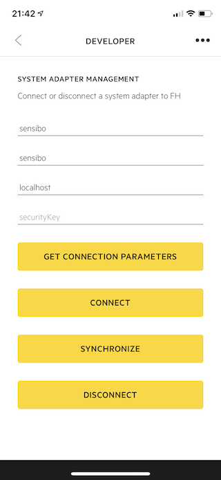
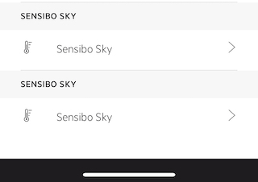

# fh-sensibo

fh-sensibo is a Futurehome app that lets you connect your Sensibo Sky unit to Futurehome.

## Overview
The app uses [Futurehome IoT Messaging Protocol - FIMP](https://github.com/futurehomeno/fimp-api) to control the air condition unit through Sensibo.  
It uses [Sensibo public API](https://sensibo.github.io/) to get a list of devices and converts them to devices in Futurehome.

The Futurehome app does not support Fan speed at this time, but when the app supports it, it will show up and work.

## Build
run: `make run`   
build debian package for arm: `make deb-arm`

## Install
The pkg can be installed using the command `dpkg -i sensibo_0.0.7_armhf.deb`.  
Or using the Futurehome app.

## Connect
After the app is installed on the smarthub you need to supply your Sensibo API key and connect the app.
This can be done from the developer menu in the Futurehome app.  
Get your Sensibo API key from [home.sensibo.com](https://home.sensibo.com/me/api)  
Type in `sensibo` in the service field and press **Get connection parameters**  
If it was successful you will see `sensibo` in the **id** field and `localhost` in the **address** field.  

Input the API key in the **securityKey** field and press **Connect**.  
You will now see one or more Sensibo devices in list of your devices in the Futurehome app.  

 

## Use
After connecting with the Sensibo app and getting the device(s) in your Futurehome app, you need to change the name and add it to a room.  
After that you can control your AC from the Climat view in the Futurehome App.

### Sync

### inclusion report

