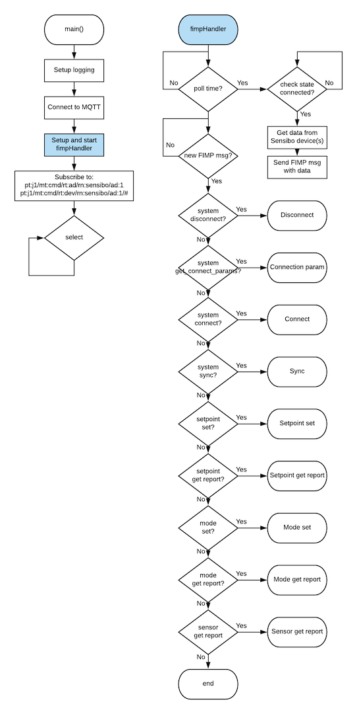

# fh-sensibo

fh-sensibo is a Futurehome app that lets you connect your Sensibo Sky unit to Futurehome. 

## Overview
The app uses [Futurehome IoT Messaging Protocol - FIMP](https://github.com/futurehomeno/fimp-api) to control the air condition unit through Sensibo.  
It uses [Sensibo public API](https://sensibo.github.io/) to get a list of devices and converts them to devices in Futurehome.

The Futurehome app has a temporary solution for controlling Fan speed and mode, but when the app supports this normally it will show up and work. 

## Build
run: `make run`   
build debian package for arm: `make deb-arm`

## Install
The pkg can be installed using the command `dpkg -i sensibo_1.1.0_armhf.deb`.  
Or using the Futurehome app in playgrounds. 

## Connect
After the app is installed on the smarthub you need to go to playgrounds -> Sensibo -> settings -> log in and enter your credentials, as well as Authorize Futurehome.
If it was successfull you will see `Authenticated`, `Configured` and `Connected` in **appdetails** in playgrounds. 

You will now see one or more Sensibo devices in list of your devices in the Futurehome app.

## Use
After connecting with the Sensibo app and getting the device(s) in your Futurehome app, you need to add it to a room.  
After that you can control your AC from the Climate view in the Futurehome App.
To controll fan speed and mode, go to playgrounds -> sensibo -> settings -> advanced setup. Set to your preferences and click save. 
Changing mode to `cool` or `auto` works, but if you at some point later on change the room temperature in the room that your sensibo device is in, it will automatically change back to `heat`.

### Sync

If you want to reinclude devices that you have deleted, go to playgrounds -> sensibo -> settings -> advanced setup -> sync, or log out and log back in. 

### inclusion report
